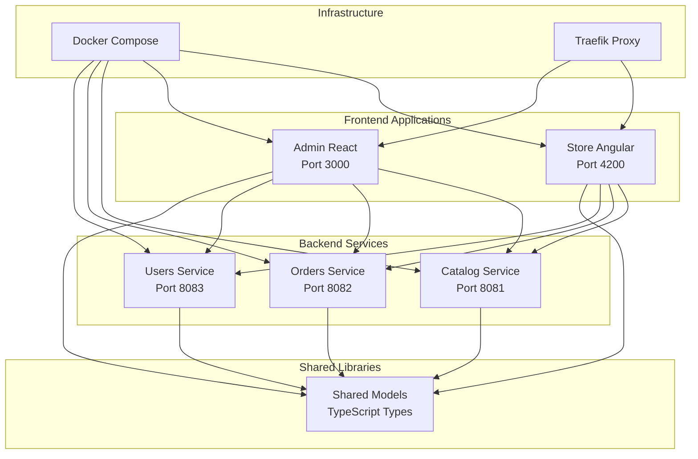

# RetailEdge

RetailEdge is an Nx monorepo with Angular storefront, React admin, and Spring Boot microservices for a retail e-commerce platform.

## 🏗️ Architecture



### Frontend Applications

- **store-angular** (Port 4200) - Angular customer-facing application
- **admin-react** (Port 3000) - React admin dashboard

### Backend Services

- **catalog-service** (Port 8081) - Product catalog management
- **orders-service** (Port 8082) - Order processing and management
- **users-service** (Port 8083) - User authentication and management

### Shared Libraries

- **shared-models** - TypeScript interfaces and types shared across applications

### Infrastructure

- **Docker** - Service containerization with multi-stage builds
- **Docker Compose** - Complete stack orchestration
- **Traefik** - Reverse proxy with automatic service discovery
- **PostgreSQL** - Primary database for all services
- **CI/CD** - GitHub Actions for automation

## 🚀 Available Commands

```bash
# Install dependencies
npm install
# or with pnpm
pnpm install

# Run all tests
npm run test

# Run specific project tests
npm run test:storefront
npm run test:admin
npm run test:shared-models

# Run e2e tests
npm run test:e2e

# Run linting
npm run lint

# Format code
npm run format

# Build all applications
npm run build

# Build specific projects
npm run build:store-angular
npm run build:admin-react
npm run build:shared-models
npm run build:catalog-service
npm run build:orders-service
npm run build:users-service

# Serve applications
npm run serve:store-angular  # Angular app on port 4200
npm run serve:admin-react    # React app on port 3000
npm run serve:catalog-service # Spring Boot on port 8081
npm run serve:orders-service  # Spring Boot on port 8082
npm run serve:users-service   # Spring Boot on port 8083

# Docker commands
npm run docker:build    # Build all Docker images
npm run docker:up       # Start all services with Docker
npm run docker:down     # Stop all services
npm run docker:logs     # View logs
npm run docker:test     # Test all endpoints
npm run docker:status   # Check service status
```

## 📁 Project Structure

```
retailedge/
├── .cursor/
│   └── rules/                      # Cursor rules
├── .github/workflows/
│   └── ci.yml                      # CI/CD workflows
├── apps/
│   ├── clients/                    # Frontend applications
│   │   ├── store-angular/          # Angular customer app
│   │   │   ├── project.json
│   │   │   └── src/...
│   │   ├── store-angular-e2e/      # E2E tests for store-angular
│   │   ├── admin-react/            # React admin app
│   │   │   ├── project.json
│   │   │   └── src/...
│   │   └── admin-react-e2e/        # E2E tests for admin-react
│   └── services/                   # Backend services
│       ├── catalog-service/        # Spring Boot
│       │   ├── project.json        # Nx wrapper for mvn
│       │   ├── pom.xml
│       │   └── src/main/java/...
│       ├── orders-service/
│       │   ├── project.json
│       │   ├── pom.xml
│       │   └── src/main/java/...
│       └── users-service/
│           ├── project.json
│           ├── pom.xml
│           └── src/main/java/...
├── infra/
│   └── docker/
│       └── init-db.sql             # Database initialization
├── docker-compose.yml              # Complete stack orchestration
├── Makefile                        # Docker management commands
├── libs/
│   └── shared/
│       └── models/                 # Shared TypeScript types
│           ├── project.json
│           └── src/index.ts
├── docs/
│   └── adrs/                       # Architecture Decision Records
├── nx.json                         # Nx configuration
├── package.json
├── tsconfig.base.json
└── README.md
```

## 🛠️ Technologies

- **Nx** - Monorepo management
- **Angular** - Customer-facing frontend
- **React** - Admin dashboard frontend
- **Spring Boot** - Backend microservices
- **TypeScript** - Type-safe development
- **Jest** - Unit testing
- **Cypress** - E2E testing
- **ESLint** - Code linting
- **Prettier** - Code formatting
- **pnpm** - Package management
- **Docker** - Containerization with multi-stage builds
- **Docker Compose** - Stack orchestration
- **Traefik** - Reverse proxy and load balancing
- **PostgreSQL** - Database

## 🚀 Quick Start

### Prerequisites
- Node.js 18+
- Java 17+
- Maven 3.6+
- Docker 20.10+
- Docker Compose 2.0+
- Make (optional, for Makefile commands)

### Installation
```bash
# Clone the repository
git clone <repository-url>
cd retailedge

# Install dependencies
npm install

# Start all services
npm run serve
```

### Individual Services
```bash
# Frontend applications
npm run serve:store-angular  # http://localhost:4200
npm run serve:admin-react    # http://localhost:3000

# Backend services
npm run serve:catalog-service # http://localhost:8081
npm run serve:orders-service  # http://localhost:8082
npm run serve:users-service   # http://localhost:8083
```

### Docker (Recommended)
```bash
# Using Make (recommended)
make up          # Start all services
make logs        # View logs
make test        # Test endpoints
make down        # Stop services

# Using npm scripts
npm run docker:build    # Build images
npm run docker:up       # Start services
npm run docker:test     # Test endpoints
npm run docker:down     # Stop services

# Using Docker Compose directly
docker-compose up -d    # Start all services
docker-compose logs -f  # View logs
docker-compose down     # Stop services
```

### Service Endpoints
- **Traefik Dashboard**: http://localhost:8080
- **Catalog API**: http://localhost/api/catalog
- **Orders API**: http://localhost/api/orders
- **Users API**: http://localhost/api/users
- **API Documentation**: http://localhost/api/{service}/swagger-ui.html

## 📚 Documentation

Each application and service has its own README with detailed instructions:

- [Store Angular](./apps/clients/store-angular/README.md) - Customer-facing application
- [Admin React](./apps/clients/admin-react/README.md) - Admin dashboard
- [Catalog Service](./apps/services/catalog-service/README.md) - Product management
- [Orders Service](./apps/services/orders-service/README.md) - Order processing
- [Users Service](./apps/services/users-service/README.md) - User management
- [Shared Models](./libs/shared/models/README.md) - Shared TypeScript types
- [Docker Setup](./DOCKER.md) - Complete Docker and containerization guide

## 📋 Architecture Decision Records

- [ADR-0001: Monorepo Architecture](./docs/adrs/0001-monorepo-architecture.md)
- [ADR-0002: Technology Stack](./docs/adrs/0002-technology-stack.md)
