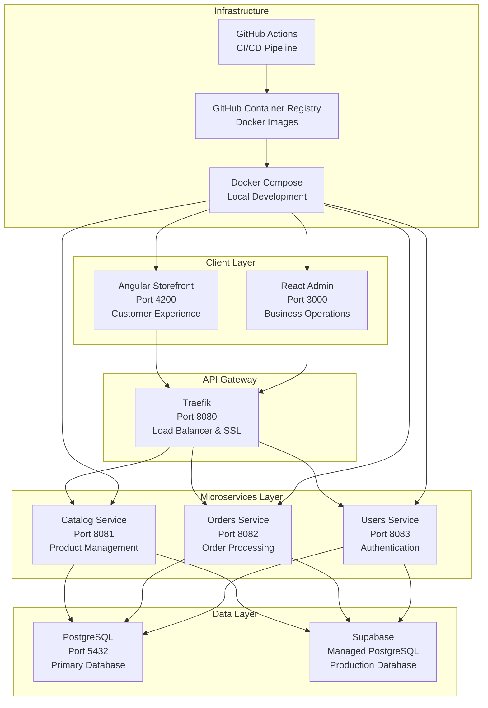

# RetailEdge

[](https://github.com/paco_/retailedge/actions/workflows/ci.yml)
[](https://github.com/paco_/retailedge/actions/workflows/ci.yml)
[](https://github.com/paco_/retailedge/actions/workflows/ci.yml)
[](https://github.com/paco_/retailedge/actions/workflows/ci.yml)
[](https://github.com/paco_/retailedge/actions/workflows/ci.yml)

## Problem

Modern e-commerce platforms face several challenges:

- **Monolithic Complexity**: Large, tightly-coupled applications that are difficult to maintain and scale
- **Technology Lock-in**: Single technology stack limits team flexibility and hiring options
- **Deployment Bottlenecks**: All-or-nothing deployments create high-risk release cycles
- **Team Coordination**: Multiple teams working on the same codebase creates merge conflicts and coordination overhead
- **Testing Complexity**: End-to-end testing becomes increasingly difficult as applications grow
- **Cost Management**: Inefficient resource utilization leads to unnecessary infrastructure costs

## Solution

RetailEdge addresses these challenges with a **modern microservices architecture** built on proven technologies:

- **Domain-Driven Design (DDD-lite)**: Clear service boundaries aligned with business domains
- **Technology Diversity**: Angular for customer-facing apps, React for admin tools, Spring Boot for APIs
- **Independent Deployments**: Each service can be deployed independently without affecting others
- **Comprehensive Testing**: Unit, integration, and E2E tests at every layer
- **Cost Optimization**: Containerized services with efficient resource utilization
- **Developer Experience**: Nx monorepo with shared tooling and consistent development workflows

## Architecture



### Service Responsibilities

| Service                | Domain              | Responsibilities                                               |
| ---------------------- | ------------------- | -------------------------------------------------------------- |
| **Catalog Service**    | Product Management  | Product CRUD, inventory tracking, search, categories           |
| **Orders Service**     | Order Processing    | Order creation, payment processing, order history, fulfillment |
| **Users Service**      | Identity & Access   | User authentication, authorization, profile management         |
| **Angular Storefront** | Customer Experience | Product browsing, shopping cart, checkout, user account        |
| **React Admin**        | Business Operations | Product management, order monitoring, user administration      |

## Run locally

### Prerequisites

- **Node.js 20+** with pnpm
- **Java 17+** with Maven 3.6+
- **Docker 20.10+** with Docker Compose 2.0+
- **Git** for version control

### Quick Start

```bash
# Clone and setup
git clone https://github.com/paco_/retailedge.git
cd retailedge
pnpm install

# Start all services with Docker
make up
# or
docker-compose up -d

# Verify services are running
make test
# or
curl http://localhost/api/catalog/actuator/health
```

### Individual Services

```bash
# Frontend applications
pnpm run serve:store-angular  # http://localhost:4200
pnpm run serve:admin-react    # http://localhost:3000

# Backend services
pnpm run serve:catalog-service # http://localhost:8081
pnpm run serve:orders-service  # http://localhost:8082
pnpm run serve:users-service   # http://localhost:8083
```

### Environment Variables

| Variable                 | Description                  | Default                                       | Required |
| ------------------------ | ---------------------------- | --------------------------------------------- | -------- |
| `DATABASE_URL`           | PostgreSQL connection string | `jdbc:postgresql://localhost:5432/retailedge` | Yes      |
| `API_BASE_URL`           | Frontend API base URL        | `http://localhost`                            | Yes      |
| `JWT_SECRET`             | JWT signing secret           | `your-secret-key`                             | Yes      |
| `SPRING_PROFILES_ACTIVE` | Spring profile               | `dev`                                         | No       |

## Deploy cheaply

### Option 1: Railway (Recommended for MVP)

```bash
# Install Railway CLI
npm install -g @railway/cli

# Login and deploy
railway login
railway init
railway up
```

**Cost**: ~$5-20/month for small applications

### Option 2: DigitalOcean App Platform

```yaml
# .do/app.yaml
name: retailedge
services:
  - name: store-angular
    source_dir: apps/clients/store-angular
    github:
      repo: paco_/retailedge
      branch: main
    run_command: nginx -g "daemon off;"
    http_port: 80
    instance_count: 1
    instance_size_slug: basic-xxs
```

**Cost**: ~$12-25/month for basic setup

### Option 3: Self-hosted VPS

```bash
# Deploy to any VPS (DigitalOcean, Linode, etc.)
git clone https://github.com/paco_/retailedge.git
cd retailedge
docker-compose -f docker-compose.prod.yml up -d
```

**Cost**: ~$5-10/month for basic VPS

### Option 4: AWS/GCP/Azure (Production)

- Use managed services (RDS, ECS, Cloud Run)
- Implement auto-scaling and load balancing
- Add monitoring and logging

**Cost**: ~$50-200/month depending on traffic

## Code Review Guidelines

### DDD-lite Structure

Review these domain boundaries and responsibilities:

```typescript
// ✅ Good: Clear domain separation
apps/services/catalog-service/
├── src/main/java/com/retailedge/catalog/
│   ├── entity/Product.java           // Domain entities
│   ├── repository/ProductRepository.java // Data access
│   ├── service/ProductService.java   // Business logic
│   └── controller/ProductController.java // API layer

// ❌ Avoid: Cross-domain dependencies
// catalog-service should not import orders-service classes
```

**Review Checklist:**

- [ ] Each service has a single, well-defined domain
- [ ] No direct dependencies between service packages
- [ ] Business logic is in service classes, not controllers
- [ ] Entities represent domain concepts, not database tables

### Configuration Separation

Ensure proper environment-based configuration:

```yaml
# ✅ Good: Environment-specific configs
src/main/resources/
├── application.yml          # Default config
├── application-dev.yml      # Development overrides
├── application-prod.yml     # Production overrides
└── application-test.yml     # Test overrides
```

**Review Checklist:**

- [ ] No hardcoded secrets or URLs
- [ ] Environment variables used for sensitive data
- [ ] Different profiles for dev/test/prod
- [ ] Configuration externalized from code

### Logging Standards

Verify structured logging implementation:

```java
// ✅ Good: Structured logging with context
log.info("Product created successfully",
    Map.of(
        "productId", product.getId(),
        "userId", getCurrentUserId(),
        "action", "CREATE_PRODUCT"
    ));

// ❌ Avoid: Unstructured logs
log.info("Product created");
```

**Review Checklist:**

- [ ] JSON structured logs in production
- [ ] Correlation IDs for request tracing
- [ ] No sensitive data in logs (passwords, tokens)
- [ ] Appropriate log levels (DEBUG, INFO, WARN, ERROR)
- [ ] Contextual information included

### Health Checks

Ensure comprehensive health monitoring:

```java
// ✅ Good: Custom health indicators
@Component
public class DatabaseHealthIndicator implements HealthIndicator {
    @Override
    public Health health() {
        // Check database connectivity
        return Health.up()
            .withDetail("database", "PostgreSQL")
            .withDetail("status", "Connected")
            .build();
    }
}
```

**Review Checklist:**

- [ ] Health endpoints return proper HTTP status codes
- [ ] Database connectivity checks
- [ ] External service dependency checks
- [ ] Memory and disk usage monitoring
- [ ] Custom business logic health indicators

### Security Review

```java
// ✅ Good: Proper authentication
@PreAuthorize("hasRole('ADMIN')")
@PostMapping("/products")
public ResponseEntity<Product> createProduct(@Valid @RequestBody ProductRequest request) {
    // Implementation
}

// ✅ Good: Input validation
public class ProductRequest {
    @NotBlank(message = "Product name is required")
    @Size(max = 100, message = "Name must be less than 100 characters")
    private String name;
}
```

**Review Checklist:**

- [ ] Authentication required for protected endpoints
- [ ] Input validation on all request DTOs
- [ ] SQL injection prevention (JPA/Hibernate)
- [ ] CORS configuration for frontend
- [ ] Rate limiting on public endpoints

## Development Commands

```bash
# Install dependencies
pnpm install

# Run all tests
pnpm run test

# Run linting and formatting
pnpm run lint
pnpm run format

# Build all applications
pnpm run build

# Start individual services
pnpm run serve:store-angular  # http://localhost:4200
pnpm run serve:admin-react    # http://localhost:3000
pnpm run serve:catalog-service # http://localhost:8081

# Docker management
make up          # Start all services
make down        # Stop all services
make logs        # View logs
make test        # Test endpoints
```

## Project Structure

```
retailedge/
├── apps/
│   ├── clients/                    # Frontend applications
│   │   ├── store-angular/          # Angular customer app
│   │   └── admin-react/            # React admin app
│   └── services/                   # Backend microservices
│       ├── catalog-service/        # Product management
│       ├── orders-service/         # Order processing
│       └── users-service/          # Authentication
├── libs/shared/                    # Shared TypeScript types
├── .github/workflows/              # CI/CD pipelines
├── docker-compose.yml              # Local development stack
└── Makefile                        # Development commands
```

## Technologies

- **Frontend**: Angular 20, React 19, TypeScript 5.9
- **Backend**: Spring Boot 3.2, Java 17, Maven
- **Database**: PostgreSQL 15, Supabase (managed)
- **Infrastructure**: Docker, Traefik, Nginx
- **Testing**: Jest, Cypress, JUnit 5
- **CI/CD**: GitHub Actions, GitHub Container Registry
- **Monorepo**: Nx with pnpm

## Documentation

- [Docker Setup](./DOCKER.md) - Complete containerization guide
- [Architecture Decision Records](./docs/adrs/) - Technical decisions and rationale
